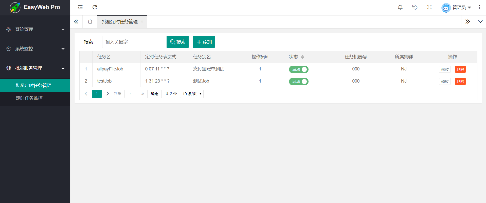
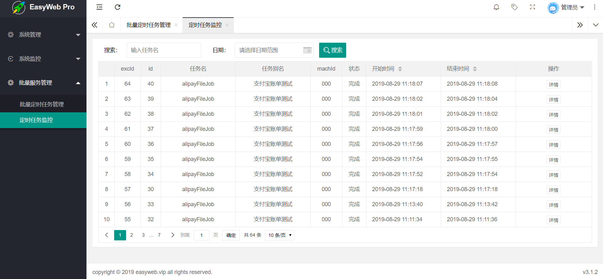

# cloudhhp
## 前言
该项目是多年金融行业应用开发的总结,剥离了相关金融业务，保留了相关基础应用架构作为参考
#### 介绍
spring cloud 微服务架构， 集成alibaba组件
#### 相关技术
- spring cloud
- nacos
- sentinel
- rocketmq
- redis
#### 相关环境 建议docker部署
- redis 一主两从三哨兵
- nacos 单机
- zipkin 服务
- mysql 单机
- rocketmq 一主
#### 功能介绍
- 集成spring cloud 和阿里巴巴相关组件
- 集成spring batch 生产可用
- 集成easyweb 后管 可做参考
- 集成mq和redis实现异步化
- 集成redisson实现分布式锁
- 集成异步线程事件模式调用
- 集成dubbo服务于nacos注册中心
- 集成链式调用（责任链模式）
- 集成异步化工作流
- 集成存储转发中心、超时转发中心
- 集成redis发布订阅模式
- 支持简单的缓存
- 待集成加解密平台...
## 1. Spring Batch
批服务调度系统是金融业务开发中需要涉及的，该应用基本生产可用
集成redis消息驱动，实现任务的续跑，重跑，定时跑等功能。

**nacos**组件提供了集群，元数据的概念，因此该batch具备了分集群，
分应用，分机组，分机器的集群部署，可以将job任务均摊到不同的应用机器上。

### 1.1 BATCH_TASK_INF 表
```sql
CREATE TABLE `BATCH_TASK_INF` (
  `ID` bigint(20) NOT NULL AUTO_INCREMENT COMMENT 'ID',
  `TASK_NAME` varchar(255) NOT NULL COMMENT '任务名',
  `TASK_EXPRESS` varchar(255) NOT NULL COMMENT '定时任务表达式',
  `ALIAS_NAME` varchar(255) DEFAULT NULL COMMENT '任务别名',
  `OPR_ID` varchar(255) NOT NULL COMMENT '操作员id',
  `TASK_STAT` char(2) NOT NULL COMMENT '状态 00停止  01启动',
  `MACH_ID` varchar(255) DEFAULT NULL COMMENT '任务机器号',
  `CLUSTER_NAME` varchar(255) DEFAULT NULL COMMENT '所属集群',
  `TASK_PARA` varchar(2000) DEFAULT NULL COMMENT '启动任务参数',
  `LAST_UPDATE_TIME` timestamp NULL DEFAULT NULL,
  `CREATE_TIME` timestamp NULL DEFAULT NULL,
  PRIMARY KEY (`ID`)
) ENGINE=InnoDB AUTO_INCREMENT=146 DEFAULT CHARSET=utf8 COMMENT='定时任务控制表';
```
### 1.2 AbstractQuartzJobBean
```java
@Slf4j
public abstract class AbstractQuartzJobBean extends QuartzJobBean {

    protected abstract String getJobName();

    @Override
    protected void executeInternal(JobExecutionContext arg0) throws JobExecutionException {
        try {
            Job job = (Job) SpringUtils.getBeanObj(getJobName());
            JobLauncher jobLauncher = (JobLauncher) SpringUtils.getBeanObj("jobLauncher");
            JobParameters jobParameters = new JobParametersBuilder()
                    .addString("date", DateTime.now().minusDays(1).toString(DateUtil.DATE_FORMAT_YYYY_MM_DD)).toJobParameters();
            jobLauncher.run(job, jobParameters);
        } catch (JobExecutionAlreadyRunningException e) {
            log.error("JobExecutionAlreadyRunningException error:{}", e);
        } catch (JobRestartException e) {
            log.error("JobRestartException error:{}", e);
        } catch (JobInstanceAlreadyCompleteException e) {
            log.error("JobInstanceAlreadyCompleteException error:{}", e);
        } catch (JobParametersInvalidException e) {
            log.error("JobParametersInvalidException error:{}", e);
        } catch (Exception e) {
            log.error("exception:{}", e);
        }
    }
}
```
### 1.3 ApplicationReadyEventListener
```java
@Slf4j
@Component
public class ApplicationReadyEventListener implements ApplicationListener<ApplicationReadyEvent> {

    @Autowired(required = false)
    BatchTaskInfMapper batchTaskInfMapper;

    @Autowired
    private NacosDiscoveryProperties nacosDiscoveryProperties;

    @Override
    public void onApplicationEvent(ApplicationReadyEvent applicationReadyEvent) {
        log.info("start ApplicationReadyEvent initialized...");
        ConfigurableApplicationContext applicationContext = applicationReadyEvent.getApplicationContext();
        CronTriggerFactory cronTriggerFactory = applicationContext.getBean(CronTriggerFactory.class);
        String clusterName = nacosDiscoveryProperties.getClusterName();
        Map<String, String> metadata = nacosDiscoveryProperties.getMetadata();
        String machId = metadata.get("AppNo") + metadata.get("GroupNo") + metadata.get("WorkNo");
        Example example = new Example(BatchTaskInf.class);
        example.createCriteria().andEqualTo("clusterName", clusterName)
                .andEqualTo("machId", machId)
                .andEqualTo("taskStat", "01");
        List<BatchTaskInf> batchTaskInfs = batchTaskInfMapper.selectByExample(example);
        for (BatchTaskInf entity : batchTaskInfs) {
            String jobName = entity.getTaskName();
            String expression = entity.getTaskExpress();
            AbstractQuartzJobBean jobBean = (AbstractQuartzJobBean) applicationContext.getBean(jobName.trim() + BatchConstants.QUARTZ_JOB_BEAN_SUFFIX);
            if (jobBean != null) {
                cronTriggerFactory.createTimingTask(expression, jobName, jobBean.getClass());
            }
        }
    }
}
```
### 1.4 CronTriggerFactory
```java
@Component
@Slf4j
public class CronTriggerFactory {

    @Autowired(required = false)
    private SchedulerFactoryBean schedulerFactoryBean;

    private static final String DEFAULT_TASK_PREFIX = "TASK-";

    private static final String DEFAULT_JOB_PREFIX = "JOB-";

    private static final String DEFAULT_TASKID = "taskId";

    /**
     * 添加或修改一个定时任务
     */
    public boolean createTimingTask(String expression, String taskId, Class<? extends QuartzJobBean> cls) {
        try {
            TriggerKey triggerKey = TriggerKey.triggerKey(DEFAULT_TASK_PREFIX + taskId, DEFAULT_JOB_PREFIX + taskId);
            // 不存在，创建一个
            JobKey jobKey = new JobKey(DEFAULT_TASK_PREFIX + taskId, DEFAULT_JOB_PREFIX + taskId);
            JobDetail jobDetail = JobBuilder.newJob(cls).withIdentity(jobKey).build();
            // 稽核任务基础信息
            jobDetail.getJobDataMap().put(DEFAULT_TASKID, taskId);
            // 表达式调度构建器
            CronScheduleBuilder cronScheduleBuilder = CronScheduleBuilder.cronSchedule(expression);
            // 按cronExpression表达式构建一个新的trigger
            CronTrigger trigger = TriggerBuilder.newTrigger().withIdentity(triggerKey).startAt(new Date()).withSchedule(cronScheduleBuilder).build();
            // 加入任务队列
            Scheduler scheduler = schedulerFactoryBean.getScheduler();
            if (scheduler.checkExists(triggerKey)) {
                stopTimingTask(taskId);
            }
            scheduler.scheduleJob(jobDetail, trigger);
            scheduler.rescheduleJob(triggerKey, trigger);
            log.info("启动定时任务taskId:{}", taskId);
            return true;
        } catch (SchedulerException e) {
            log.error("create timing task:{} error:{}", taskId, e);
        }
        return false;
    }


    public boolean stopTimingTask(String taskId) {
        log.info("停止定时任务: taskId:{}", taskId);
        Scheduler scheduler = schedulerFactoryBean.getScheduler();
        TriggerKey triggerKey = TriggerKey.triggerKey(DEFAULT_TASK_PREFIX + taskId, DEFAULT_JOB_PREFIX + taskId);
        try {
            scheduler.pauseTrigger(triggerKey);
            scheduler.unscheduleJob(triggerKey);// 移除触发器
            scheduler.deleteJob(new JobKey(DEFAULT_TASK_PREFIX + taskId, DEFAULT_JOB_PREFIX + taskId));// 删除任务
            return true;
        } catch (SchedulerException e) {
            log.error("stop timging task key:{} error:{}", taskId, e);
        }// 停止触发器
        return false;
    }
}
```
列出了主要的代码和表结构，可以组成job的定时，提供了redis List轮训方式实现以下两种功能
1. job定时状态的启动和停止
2. job续跑，重跑，创建、取消

### 1.5 easyweb后管集成springbatch管理



## 2. 异步化
使用mq和redis实现生产者消费者异步化解耦
- **tip1**: 使用注解驱动和**lambda** 减少**if-else**，
- **tip2**: **redisson** 分布式锁的应用是一种安全机制，系统通过对key上锁，保证系统的安全性
- **tip3**: 开启异步线程通过事件模式实现
```java
public class TestEvent extends Event {
    //todo
}

//使用自定义注解 注册这个handler
@Slf4j
@ExecutorHandler
public class TestEventHandler implements EventHandler<TestEvent> {
    @Override
    public void handler(TestEvent event) {
        log.info("TestEventHandler start");
        //todo
        log.info("TestEventHandler end");
    }

    @Override
    public Class<TestEvent> getAcceptedEventType() {
        return TestEvent.class;
    }
}

@Slf4j
@MqBusiHandler(transNetId = "1")
public class CoreServiceImpl extends BaseService implements CoreService {

    @Autowired
    public DefaultEventManager defaultEventManager;

    @Override
    public void test(MqMessage msg) throws Exception {
        String methodName = Thread.currentThread().getStackTrace()[1].getMethodName();
        log.info("logId={},{} start", msg.getLogId(), methodName);
        //todo
        msg.setCoreId(sequenceService.nextId("core"));
        msg.setDesc("core 响应");
        String key = "core" + msg.getLogId();
        redisTemplate.opsForList().leftPush(key, JSON.toJSONString(msg));
        redisTemplate.expire(key, 10000, TimeUnit.MILLISECONDS);
        //执行异步TestEvent
        defaultEventManager.doService(new TestEvent());
        log.info("logId={},{} end", msg.getLogId(), methodName);
    }

    @Override
    public void asyncExecute(MqMessage msg, MqBusiServiceCallback callback) {

    }

    @Override
    public void asyncExecuteFunc(MqMessage msg, MqBusiServiceCallback callback) {
        try {
            redisLockService.lockCoreId(msg);
            MqCoreFuncFactory.getMethod(msg.getBizType()).execute(this, msg);
            callback.onSuccess(msg);
        } catch (Throwable e) {
            callback.onException(e);
        } finally {
            redisLockService.unlockCoreId(msg);
        }
    }
}

@Slf4j
@RestController
@RequestMapping("/test")
public class TestController {
    @Autowired
    RocketMq2CoreProducer rocketMq2CoreProducer;
    @Autowired
    RedisTemplate redisTemplate;
    @Autowired
    LogIdUtil logIdUtil;


    @RequestMapping("/asyncSend")
    public MqMessage cloudPayReverse() throws Exception {
        String logId = logIdUtil.nextId();
        MqMessage msg = MqMessage.builder()
                .logId(logId)
                .transnetId("1")
                .bizType("test")
                .build();
        rocketMq2CoreProducer.asyncSend(msg);
        String key="core"+logId;
        //同步阻塞
        String resp = (String) redisTemplate.opsForList().rightPop(key, 10000, TimeUnit.MILLISECONDS);
        if (resp == null) {
            msg.setDesc("core超时");
        } else
            msg = JsonUtil.getObjectFromJson(resp, MqMessage.class);
        log.info("logId={},position=RecvRsp,currentTime={},receiveRespMsg={}", logId, System.currentTimeMillis(), msg);
        return msg;
    }
}
```
## 3.Dubbo与Nacos
- Nacos是阿里新一代的注册中心和配置中心，相较于Zookeeper（写性能瓶颈，惊群效应等），Eureka（2.x 不再维护，可能跳票） 存在一定的优势（可了解一下nacos压测报告），且一直在更新和优化
- Dubbo是阿里的RPC框架，目前还是2.X，比较期待3.X，该架构设计目的是为了满足高并发小数据量的 rpc 调用，比较符合金融业高并发场景，但是
在大数据量下的性能表现并不好，建议合理选择通信协议
```java
public interface HelloDubboService {
    String hello(String name);
}

@Slf4j
@Service(version = "${demo.service.version}")
public class HelloDubboServiceImpl implements HelloDubboService {
    @Value("${demo.service.name}")
    private String serviceName;

    @Override
    public String hello(String name) {
        String methodName = Thread.currentThread().getStackTrace()[1].getMethodName();
        log.info("HelloDubboService name={},{} start", name, methodName);
        RpcContext rpcContext = RpcContext.getContext();
        return String.format("Service [name :%s , port : %d] %s(\"%s\") : Hello,%s",
                serviceName,
                rpcContext.getLocalPort(),
                rpcContext.getMethodName(),
                name,
                name);
    }
}

@Service
public class RpcCommonService {

    @Reference(version = "${demo.service.version}", timeout = 10000, retries = 0)
    public HelloDubboService helloDubboService;
}

@RestController
@RequestMapping("/test")
public class TestController {
    @Autowired
    private RpcCommonService rpcCommonService;

    @RequestMapping("/helloDubbo")
    public String helloDubbo() throws Exception {
        String methodName = Thread.currentThread().getStackTrace()[1].getMethodName();
        log.info("TestController,{} start", methodName);
        String resp = null;
        try {
            resp = rpcCommonService.helloDubboService.hello("gate");
        } catch (Exception e) {
            log.error("调用core 异常",e);
            return "调用core 异常";
        }
        return resp;
    }
}
```


## 4. 缓存的使用
- 封装的注解
```@EnableAppeventBroad//开启redis事件广播```
```@EnableAppeventSubscriber//开启redis事件订阅```
- 订阅数据字典的广播，实现应用动态刷新缓存
- RPC服务
```DictService```

### 小结
- 项目本身比较粗糙，真正使用需要结合业务场景，对系统模块，通讯协议，包结构进行重构优化
- 通过**MQ**对系统进行削峰平谷、解耦、异步 会让系统更加高可用（中间件高可用前提）
- 存储转发和超时转发是系统的补偿机制，在没有复杂分布式事务的情况可以保障一致性

 感谢捐赠 github代码：https://github.com/feiweiwei/BillSpringBatch